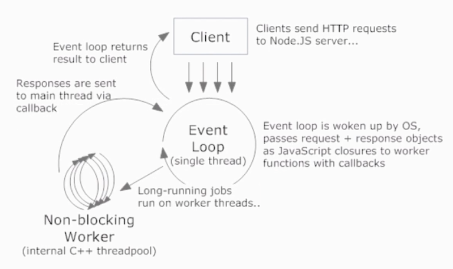

### NodeJs 是什么
- Node.js is a Javascript runtime built on Chrome's V8
- Node.js uses an event-driven,non-blocking I/O model

#### 非阻塞 I/O
- 阻塞： I/O 时进程休眠等待 I/O 完成后进行下一步
-  I/O 时函数立即返回，进程不等待 I/O 完成

#### 事件驱动
- I/O 等异步操作结束后的通知
- 观察者模式

### 为什么偏爱 NodeJs
- 前端职责范围变大，统一开发体验
- 在处理高并发、 I/O 密集场景性能优势明显

#### CPU 密集 vs I/O 密集
- CPU 密集：压缩、解压、加密、解密
- I/O 密集：文件操作、网络操作、数据库

#### web 常见场景
- 静态资源读取
- 数据库操作
- 渲染页面

#### 高并发应对之道
- 增加机器数
- 增加每台机器的 CPU 数---多核

#### 进程
- 进程：是计算机中的程序关于某数据集合上的一次运行活动，是系统进行资源分配和调度的基本单位。
- 多进程：启动多个进程，多个进程可以一块执行多个任务

#### 线程
- 线程：进程内一个相对独立的、可调度的执行单元，与同属一个进程的线程共享进程的资源
- 多线程：启动一个进程，在一个进程内启动多个线程，这样，多个线程也可以一块执行多个任务

#### NodeJs 的单线程
- 单线程只是针对主进程，I/O 操作系统底层多线程调度
- 单线程不是单进程

#### NodeJs 工作模型


#### 常用场景
- web server
- 本地代码构建
- 实用工具开发

### 环境 & 调试
#### 环境
- CommonJS
  - 每个文件是一个模块，有自己的作用域
  - 在模块内部 module 变量代表模块本身
  - module.exports 属性代表模块对外接口
  -  require 规则
	- / 表示绝对路径，./ 表示相对于当前文件的
	- 支持 js、json、node 扩展名，不写依次尝试
	- 不写路径则认为是 build-in 模块或者各级 node_modules 内的第三方模块
  - require 特性
    - module 被加载的时候执行，加载后缓存
    -
- global
- process

chalk npm 包可以在命令行输出有颜色的、下划线、阴影  
`npm root -g`看全局安装路径。

#### global
- CommonJS
- Buffer（二进制数据处理）、process、console
  - process.cwd() 当前命令所执行的路径
  - process 下的 argv, argv0, execArgv, execPath
  - process.env
- timer
  - process.nextTick 把回调函数放在当前队列的最后一个
  - setImmediate 回调函数放在下个队列的队首
  - setTimeout 是放在两者之间

#### 调试
- Inspector
  - node --inspect-brk 14_debug.js
- VS Code
  - 条件调试
  - ```
{
	"type": "node",
	"request": "launch",
	"program": "${file}",
	"cwd": "${cwd}"
}
```

### NodeJs 基础 API
#### path
和路径有关的一切  
nodejs.cn 访问中文文档。  
- normalize join resolve
- basename extname dirname
- parse format
- sep delimiter win32 posix

- __dirname、 __filename 总是返回文件的绝对路径
- process.cwd() 总是返回执行 node命令所在文件夹

./:
- 在 require 方法中总是相对当前文件所在文件夹
- 在其他地方和 process.cwd() 一样，相对 node 启动文件夹

#### Buffer
- 用于处理二进制数据流
-实例类似整数数组，大小固定
- C++ 代码在 V8 堆外分配物理内存
- Buffer.byteLength
- Buffer.ifBuffer()
- Buffer.concat()
- buf.length
- buf.toString()
- buf.fill()
- buf.equals() 两个buffer 的内容是否相等
- buf.indexOf
- buf.copy

#### event
#### fs
高并发的时候用同步函数会挡住其他用户
- readFile
- writeFile
- stat
- rename
- unlink
- readdir
- mkdir
- rmdir
- watch
- createReadStream
  - stream：有方向的数据
- createWriteStream

解决回调地狱问题：promisify、async

### 项目初始化
#### .gitignore 
- 匹配模式前加 / 代表项目根目录
- 匹配模式最后加 / 代表是目录
- 匹配模式前加 ! 代表取反
- * 代表任意个字符
- ? 匹配任意一个字符
- ** 匹配多级目录

`.npmignore`是发布包到npm上时需要忽略的文件  
`.editorconfig`  

#### ESLint
eslint.cn/docs/about/
安装：
```shell
npm i -S eslint babel-eslint
```
生产 eslint 配置文件：
```shell
eslint --init
```
使用 precommit git 钩子，代码错误不能提交
```shell
npm i pre-commit -S
```
`.eslintignore`忽略文件，`.eslintrc.js`配置文件


### 案例项目--静态资源服务器
官方文档：
nodejs.cn/api

安装命令行输出美化包：
```shell
npm i chalk -S
```
浏览器接收响应渲染 html 页面设置：
```js
  res.setHeader('Content-Type', 'text/html')
```
自动重启服务包：
```
npm i -g supervisor
```
使用`supervisor app.js`启动文件

#### handlebars 模板引擎
handlebarsjs.com
```
npm i handlebars
```
读取文件时不要用相对路径，因为相对路径和启动目录有关
