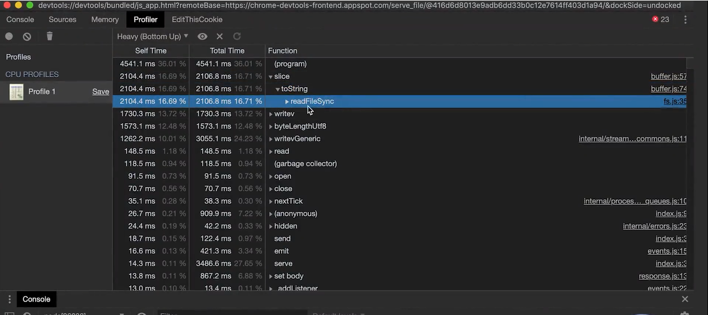
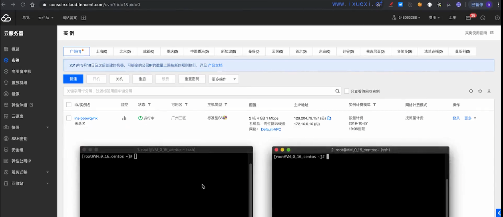
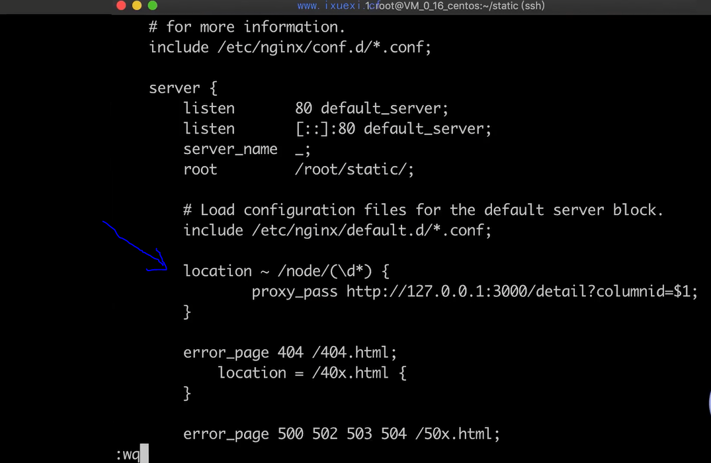
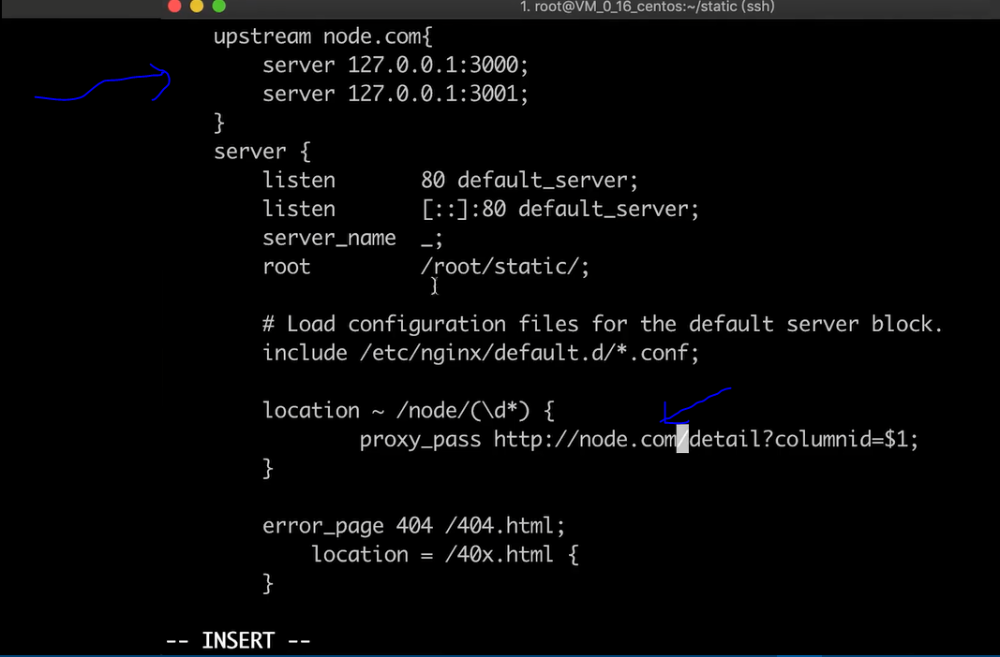
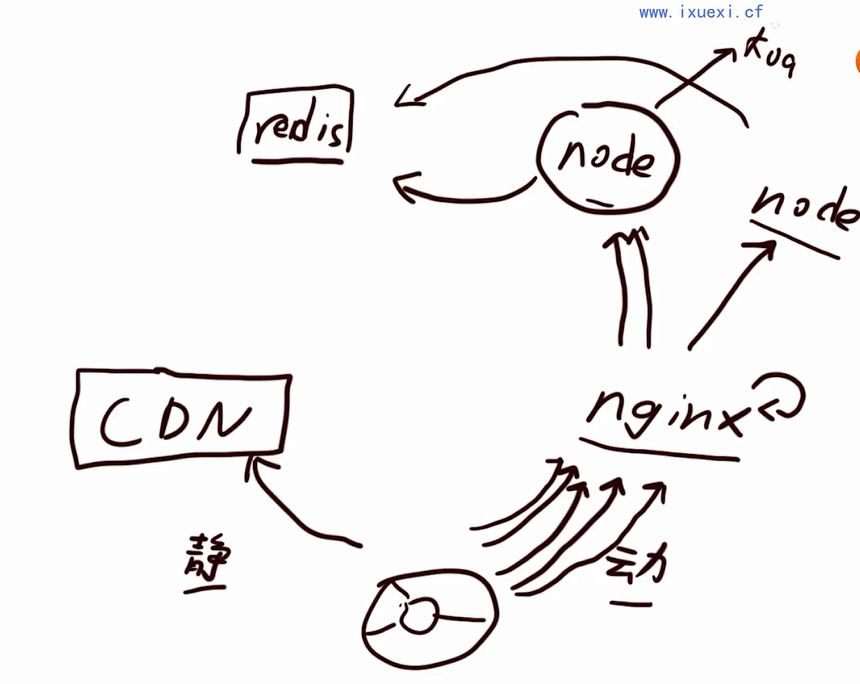

# 性能优化

## HTTP 服务性能测试

- 想要优化性能，首先要做性能检查
- 压力测试工具
  - ab（apache bench）
    - 命令行输入：`ab -c200 -n1600 http://127.0.0.1:3000/download`
    - 返回的数据中比较重要的有：Requests per second(每秒处理并发量)、Transfer rate（吞吐量）、Time per request、
  - webbench
- 找到性能瓶颈所在地，配合linux 命令：
  - top（cpu、内存占用情况）
  - iostat

## Nodejs 性能分析工具

- 工具
  - Node.js 自带 profile
    - 命令行启动node时加上`--prof`
    - 分析输出的log文件：`node --prof-process <xxx.log> > profile.txt`
  - Chrome devtool
    - `node --inspect-brk entry.js`
    - 进入 chrome，在地址栏输入`chrome://inspect`，会发现
    - 
  - Clinic.js

## JavaScript 代码性能优化

- 计算性能优化的本质
  - 减少不必要的计算
  - 空间换时间
- Node.js HTTP 服务性能优化准则：
  - 提前计算

## 内存优化管理

- 垃圾回收
- 新生代
  - 容量小，遍历一个容量小的空间垃圾回收就会更快
- 老生代
  - 容量大，垃圾回收更慢
- 减少内存使用，也是提高服务性能的手段
- 如果有内存泄漏，会导致服务性能大大降低
- Node.js Buffer 的内存分配策略
- 节省内存的最好的方式
  - 使用池

## 使用 C++ 插件优化 Node服务性能

C++ Addons  
node-gyp

- 将计算量转移到 C++ 进行
  - 收益：C++ 运算比 JavaScript 更快的部分
  - 成本：C++ 变量和V8 变量的转换

## 多进程优化

### Node.js 子进程与线程

- 进程
  - 操作系统挂载运行程序的单元
  - 拥有一些独立的资源，如内存等
- 线程
  - 进行运算调度的单元
  - 进程内的线程共享进程内的资源
- Node.js 的事件循环
  - 主线程运行v8与JavaScript
  - 多个子线程通过事件循环被调度
- 使用子进程或线程利用更多CPU资源

参考 `./多进程优化` 目录下的代码，master.js 是主进程入口。

父进程和子进程是可以像服务器与服务器之间通信一样，走一个RPC调用的方式使用全双工通信

Worker Threads 工作线程。

### Node.js cluster 模块

在 Node 中如何做到多个进程监听一个端口？

### Node.js 进程守护与管理

- Node.js 的稳定性

参考`./多进程优化` 目录下的代码，cluster.js，增加的部分。

涉及：心跳检测进程，检查内存泄漏。 

## 架构优化

- 静态内容
  - 基本不会动，也不会因为请求参数不同而变化
  - 静态内容不会放在nodejs服务器，而是像apche、nginx专业的使用C++底层技术做成的服务器，作为一个源站。
  - CDN 分发，HTTP 缓存 等
- 动态内容
  - 各种因为请求参数不同而变动，且变种的数量几乎不可枚举
  - 用大量的源站机器承载，结合反向代理做负载均衡，分布式的部署都会使用负载均衡做一个均衡
  - 动态内容不好做缓存，变化不可枚举
- 使用腾讯云云服务器的动静分离例子



在云服务器上装好 nginx 和 nodejs

```shell
yum install nginx
nginx -v
# 启动nginx，会在80端口启动服务
nginx
# 判断是否80端口已经被占用
netstat -nlp | grep 80
# 查看 nginx 配置
vi /etc/nginx/nginx.conf
# 把user nginx 改成 user root 提升访问权限，然后重启nginx
nginx -s reload

yum install nodejs
```

安装 ab 工具：

```shell
yum install httpd-tools
```

### 反向代理与缓存服务





在配置中，location 下可以配置 proxy_cache 做缓存。

redis缓存。
空间换时间

